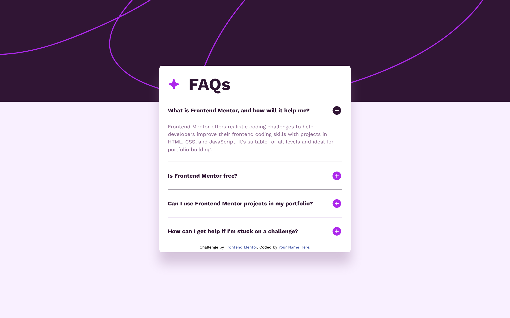
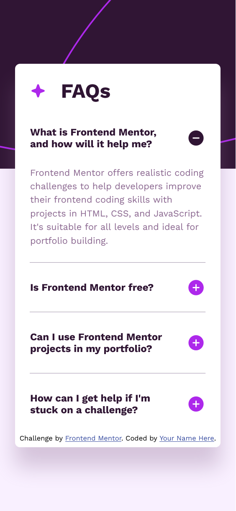

# Frontend Mentor | FAQ accordion

This is a solution to the [FAQ accordion challenge on Frontend Mentor](https://www.frontendmentor.io/challenges/faq-accordion-wyfFdeBwBz). Frontend Mentor challenges help you improve your coding skills by building realistic projects. 

## Table of contents

- [Overview](#overview)
  - [Screenshots](#screenshot)
  - [Links](#links)
- [My process](#my-process)
  - [Built with](#built-with)
  - [What I learned](#what-i-learned)
- [Author](#author)
- [Acknowledgments](#acknowledgments)

## Overview

### Screenshot

### Links

- [Live Site URL](https://thethirdremegio.github.io/Frontend-Mentor-FAQ-Accordion/)

## My process

### Built with

- Semantic HTML5 markup
- SCSS variables
- CSS Flexbox

## Author

- Website - [the_iii](https://thethirdremegio.github.io/Frontend-Mentor-FAQ-Accordion/)
- Frontend Mentor - [@TheThirdRemegio](https://www.frontendmentor.io/profile/TheThirdRemegio)

## Acknowledgments

Thank you, dad, for being my strength and guiding me with a firm hand.

Thanks a lot to Frontend Mentor for encouraging me and others to dip their toes into the initially-intimidating waters of development, so to speak. I was more nervous than I thought, as this was my first experience having someone give me a design to code, so this experience will do wonders for preparing me for my next challenges and projects!

Thanks also to Reddit's programming community who recommended Frontend Mentor time and time again.

Until next time! 👋
